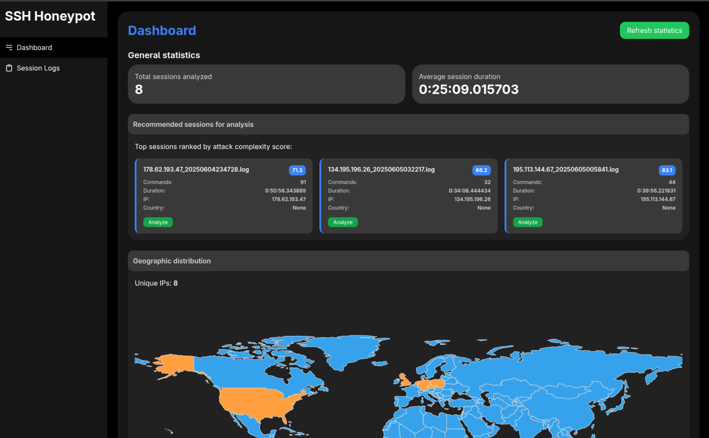
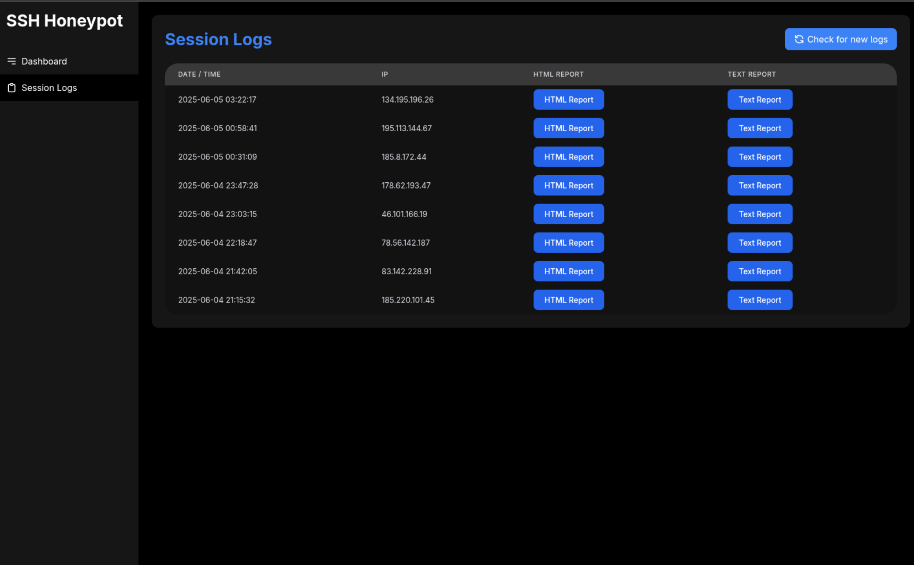
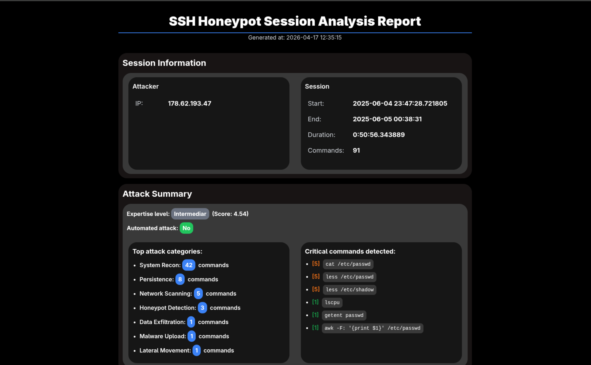

# SSH Honeypot

> **Dissertation Project** — A high-interaction SSH honeypot for capturing and analyzing attacker behavior in isolated container environments.


---

## Overview

This system implements a high-interaction SSH honeypot that accepts inbound connections on a configurable port, routes each session into a dedicated Docker container, and records all attacker activity for post-session analysis.

The SSH server is built on top of **Paramiko** and accepts authentication regardless of the credentials provided. Once authenticated, the attacker is placed into a Debian 12 container that exposes a functional shell environment with a pre-populated filesystem — including decoy files such as `credentials.db`, `ssh_keys.txt`, and `backup.tar.gz` — intended to elicit meaningful behavior. Outbound traffic from the container is blocked via `iptables` rules applied at startup to prevent use as a relay or pivot point.

Session data is written to structured log files containing per-command entries with timestamps, which are then processed by a two-tier analysis pipeline: a **SessionAnalyzer** that operates on individual log files, and a **GlobalAnalyzer** that aggregates statistics across the entire log directory. The session analyzer reconstructs the attack timeline into discrete phases, classifies commands across 10 behavioral categories, scores command severity, and evaluates attacker expertise based on command complexity, category diversity, phase ordering, and evasion attempts. Files transferred into the container during a session are moved to a quarantine directory.

A **Flask web interface** provides access to per-session HTML forensic reports and global dashboards covering geographic distribution, attack category breakdown, command frequency, and temporal attack patterns.

This project was developed as a **dissertation thesis** in cybersecurity, focused on studying attacker TTPs (Tactics, Techniques, and Procedures) through controlled observation.

---

## Features

- Paramiko-based SSH server accepting all credentials on a configurable port
- Per-session Docker container provisioning with network isolation via iptables
- Decoy filesystem with trap files in plausible locations
- Structured per-session logging with millisecond timestamps
- Behavioral classification across 10 attack categories with per-command severity scoring
- Attacker expertise evaluation based on command complexity, phase logic, and evasion patterns
- Attack phase reconstruction: Reconnaissance → Exploitation → Persistence → Data Collection → Cleanup
- Automated vs. manual attack detection based on inter-command timing analysis
- Per-session HTML forensic report generation
- Global web dashboard with geographic, temporal, and categorical statistics
- Quarantine directory for files uploaded during attacker sessions
- Configurable connection concurrency limit

---

## Architecture

```
Attacker
    │
    ▼ SSH (port 2222)
┌─────────────────────┐
│     SSH Server      │  ← Paramiko, accepts all credentials
│   (ssh_server.py)   │
└────────┬────────────┘
         │ spawn
         ▼
┌─────────────────────┐
│  Docker Container   │  ← Debian 12, functional shell, decoy files
│  (honeypot-<ip>)    │  ← Outbound traffic blocked via iptables
└────────┬────────────┘
         │ log
         ▼
┌─────────────────────┐     ┌──────────────────────┐
│   Session Logger    │────▶│  logs/<ip>_<ts>.log  │
└─────────────────────┘     └──────────┬───────────┘
                                        │ analyze
                                        ▼
                            ┌──────────────────────┐
                            │   Global Analyzer    │  ← Aggregate statistics
                            │   Session Analyzer   │  ← Per-session forensics
                            └──────────┬───────────┘
                                        │
                                        ▼
                            ┌──────────────────────┐
                            │     Flask GUI        │  ← http://127.0.0.1:5000
                            └──────────────────────┘
```

---

## Installation

### Requirements

- Python 3.10+
- Docker
- Linux (tested on Fedora)

### 1. Clone the repository

```bash
git clone https://github.com/<username>/ssh-honeypot.git
cd ssh-honeypot
```

### 2. Install Python dependencies

```bash
pip install -r requirements.txt
```

### 3. Build the Docker image

```bash
docker build -t ssh-honeypot:latest -f docker/Dockerfile .
```

### 4. Run

```bash
python main.py
```

The SSH server starts on port **2222**. The web interface is available at **http://127.0.0.1:5000**.

> To expose the honeypot externally, redirect port 22 to 2222 via `iptables` or change the port in `config/config.json`.

---

## Configuration

`config/config.json`:

```json
{
    "server": {
        "host": "0.0.0.0",
        "port": 2222,
        "max_connections": 10
    },
    "docker": {
        "image": "ssh-honeypot:latest",
        "mem_limit": "512m",
        "cpu_count": 1
    },
    "enable_geo_ip": true
}
```

| Parameter | Description |
|---|---|
| `server.port` | Listening port for the SSH server |
| `server.max_connections` | Maximum concurrent sessions |
| `docker.mem_limit` | Memory limit per container |
| `enable_geo_ip` | Enable IP geolocation lookup |

---

## Screenshots

### Main Dashboard
<!--  -->
*coming soon*

### Session List
<!--  -->
*coming soon*

### Session Report
<!--  -->
*coming soon*

---

## Attack Categories

Commands are matched against 10 behavioral categories using regex pattern sets defined per-module:

| Category | Description |
|---|---|
| `system_recon` | System enumeration (`uname`, `id`, `ps`, `env`, `hostname`) |
| `privilege_escalation` | Privilege escalation attempts (`sudo`, `chmod 777`, kernel exploits) |
| `data_exfiltration` | Data transfer commands (`scp`, `curl`, `wget`, archiving) |
| `persistence` | Persistence mechanisms (`crontab`, service creation, backdoors) |
| `honeypot_detection` | Container/sandbox environment detection (`proc` checks, timing probes) |
| `network_scanning` | Network enumeration (`nmap`, `ping`, `netstat`, `ss`) |
| `brute_force` | Credential brute-force against local or remote services |
| `file_access` | Access to sensitive paths (`/etc/passwd`, `/etc/shadow`, trap files) |
| `malware_upload` | Remote file retrieval and execution (`wget`/`curl` + `chmod +x`) |
| `lateral_movement` | Internal SSH connections, credential harvesting |

---

## Analysis & Reporting

### Session analysis

The `SessionAnalyzer` processes a single log file and produces:

- **Attacker profile** — expertise score (0–10) derived from command complexity, attack category diversity, phase sequence logic, and evasion attempt count; classified as Beginner / Intermediate / Advanced / Expert
- **Attack phase timeline** — commands mapped chronologically to phases: Reconnaissance, Exploitation, Persistence, Data Collection, Cleanup
- **Critical command list** — commands matching high-severity patterns or belonging to high-priority categories, sorted by severity score
- **Uploaded file detection** — `wget`/`curl`/`scp` command parsing to identify transferred files
- **Resource access map** — files, directories, processes, and network targets referenced across the session
- **Timing analysis** — inter-command interval statistics used to distinguish manual from automated (scripted) sessions

### Global analysis

The `GlobalAnalyzer` scans all session logs in the `logs/` directory and aggregates:

- Total and unique attacker IP counts with geographic metadata
- Attack category distribution (counts and percentages)
- Top commands by frequency across all sessions
- Hourly and day-of-week attack distribution
- Per-session sophistication scores for ranking

---

## Container Environment

The Debian 12 container is configured as follows:

- Users: `root`, `admin`, `developer`, `support` with intentionally weak passwords
- Hostname set to `srv-web-03` to resemble a production web server
- Decoy files placed in non-obvious paths (`/var/cache/apt-archives/partial/.old/cache.db`, `/usr/local/share/app-data/.config/credentials.txt`, etc.)
- Pre-populated `.bash_history` for `root` and `admin`
- Fake log entries in `/var/log/syslog` and `/var/log/auth.log`
- System modification commands (`passwd`, `useradd`, `su`) replaced with wrappers returning permission errors
- Outbound network access blocked at container startup via `block_network.sh`

---

## Tech Stack

| Component | Technology |
|---|---|
| SSH Server | Python, Paramiko |
| Isolation | Docker, Debian 12 |
| Web Interface | Flask, Jinja2 |
| Analysis | Python (re, collections, datetime) |
| Logging | Python logging, structured `.log` files |
| Configuration | JSON |

---

## Project Structure

```
ssh-honeypot/
├── main.py                          # Entry point, starts SSH server and GUI threads
├── requirements.txt
├── config/
│   ├── config.json                  # Main configuration file
│   ├── honeypot_files/              # Decoy files deployed into the container
│   │   ├── backup.tar.gz
│   │   ├── client_list.csv
│   │   ├── credentials.db
│   │   ├── daemon.conf
│   │   ├── passwords.txt
│   │   ├── server_config.yaml
│   │   └── ssh_keys.txt
│   └── honeypot_files.sh
├── docker/
│   ├── Dockerfile                   # Debian 12 container image definition
│   └── scripts/
│       ├── block_network.sh         # Blocks outbound traffic via iptables
│       ├── hide_container.sh
│       ├── monitor_iptables.sh
│       ├── network_restrictions.sh
│       └── startup.sh
├── honeypot/
│   ├── __init__.py
│   ├── config.py                    # Loads config/config.json into CONFIG dict
│   ├── container_manager.py         # Docker container lifecycle management
│   ├── session_logger.py            # Per-session log file writer, IP geolocation
│   ├── server/
│   │   ├── __init__.py
│   │   ├── ssh_server.py            # Main SSH server loop, connection handling
│   │   ├── shell_handler.py         # Interactive shell session, SSHHoneypot class
│   │   └── scp_handler.py           # SCP upload/download capture
│   ├── analyzer/
│   │   ├── __init__.py
│   │   ├── common.py                # Shared parsing utilities (log parsing, IP info, classification)
│   │   ├── attack_patterns.py       # CommandMatcher, loads category modules dynamically
│   │   ├── global_analyzer.py       # Aggregates statistics across all session logs
│   │   ├── session_analyzer.py      # Per-session behavioral analysis and report generation
│   │   ├── report_generator.py      # HTML and text report rendering
│   │   └── categories/
│   │       ├── __init__.py          # AttackCategory base class
│   │       ├── brute_force.py
│   │       ├── data_exfiltration.py
│   │       ├── file_access.py
│   │       ├── honeypot_detection.py
│   │       ├── lateral_movement.py
│   │       ├── malware_upload.py
│   │       ├── network_scanning.py
│   │       ├── persistence.py
│   │       ├── privilege_escalation.py
│   │       └── system_recon.py
│   └── gui/
│       ├── __init__.py
│       ├── gui.py                   # Flask app, route definitions
│       └── templates/
│           ├── index.html           # Main dashboard
│           ├── session_logs.html    # Session list
│           └── error.html
├── logs/                            # Session log files (<ip>_<timestamp>.log)
└── quarantine/                      # Files uploaded by attackers during sessions
```

---

## License

MIT License. See `LICENSE` for details.

---

> Developed as a dissertation thesis project for educational and cybersecurity research purposes.